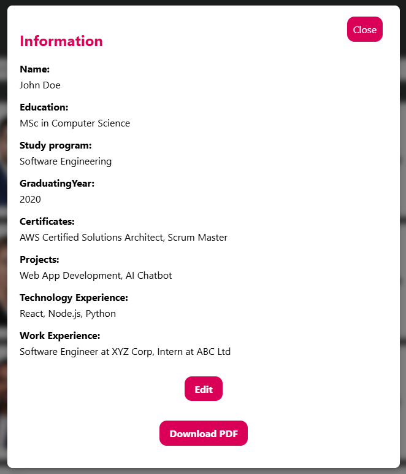
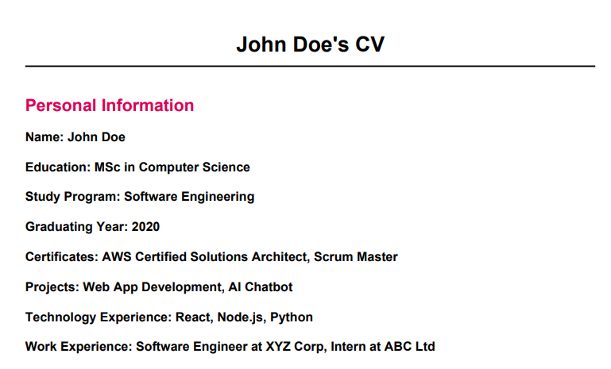

# App Project for Pinja to manage consultants
This project was bootstrapped with [Create React App](https://github.com/facebook/create-react-app).

This project was apart of my react.js course in Vaasa University of Applied Sciences
The assinment was to create an app where you can:
- Edit consultants cv/info (As main user)
- Search for consultants
- Add consultants to team
- Download team pdf
- Download consultants CV/info to pdf
- Edit your own profile info/CV (As main user)

## Interface

## Usage
As logged in user you can:
- Edit consultants cv/info
- Search for consultants
- Add consultants to team
- Download team pdf
- Download consultants CV/info to pdf
- Edit your own profile info/CV

## CV

## PDF for one consultant

## Team PDF

## Profile

