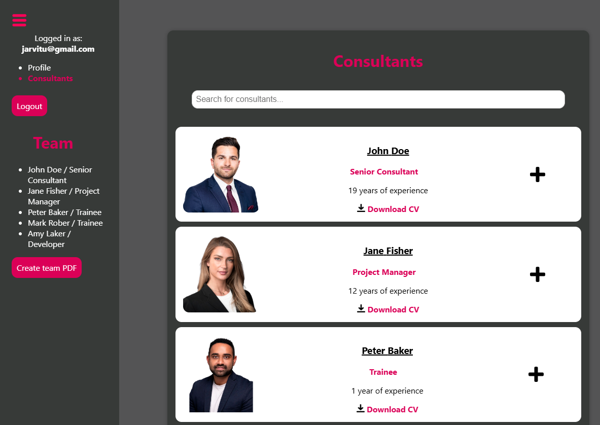

# App Project for Pinja to manage consultants

This project was bootstrapped with [Create React App](https://github.com/facebook/create-react-app).

## Interface

## Usage
As logged in user you can:
- Edit consultants info
- Search for consultants
- Download consultants CV in pdf
- Edit your own profile info

You can't edit the CV straight from the interface. You have to update the pdf file in the public directory.

